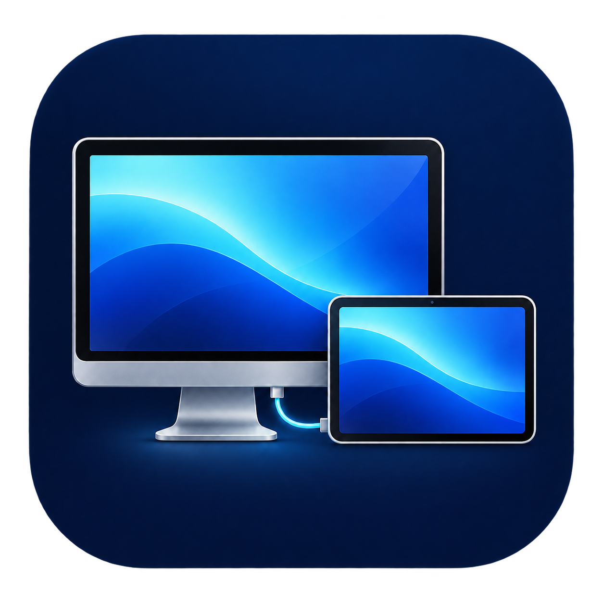

<p align="center"></p>

# Pad Display

**USB-C로 안드로이드 패드를 Mac의 확장 모니터로 사용합니다.**

A native macOS + Android experiment for a wired second display, with a separate low-latency cursor channel, pen input and finger touch.

현재 버전: **1.6** · [변경 내역](CHANGELOG.md)

## 기능

| 항목 | 지원 범위 |
| --- | --- |
| 화면 | 확장 모니터 또는 주 화면 복제 |
| 원본 해상도 | 2944 × 1840 실제 픽셀 |
| Retina | 1472 × 920 작업 공간을 2배 픽셀로 표시 |
| 주사율 | 가상 디스플레이와 지원하는 Android 패널에 120Hz 요청 |
| 커서 | 영상과 분리하여 움직일 때 최대 120Hz 전송, 실제 macOS 커서 모양 반영 |
| 영상 | H.264 하드웨어 인코딩·디코딩, 최대 60fps 또는 30fps |
| 손가락 | 탭, 더블 탭, 드래그, 두 손가락 스크롤 |
| 펜 | 클릭, 드래그, 필압, 기울기, 옆 버튼을 누른 채 접촉해 오른쪽 클릭 |

120Hz 패널·커서와 영상 프레임 속도는 서로 다릅니다. 이 버전은 영상 120fps를 제공하지 않습니다. 해상도 옵션은 현재 검증한 패드에 맞춰 구성했으며, 다른 패드에서는 화면 비율과 성능이 달라질 수 있습니다.

## 설치와 사용

필요 환경: macOS 14 이상, Android 9 이상, 데이터 전송이 가능한 USB 케이블, Mac의 ADB. 현재 실제 기기 검증 환경은 Apple Silicon Mac Studio(macOS 27)와 Lenovo Idea Tab Pro(Android 16), Lenovo Tab Pen Plus입니다.

1. Mac에 ADB를 설치합니다. Homebrew를 사용한다면 `brew install --cask android-platform-tools`로 설치할 수 있습니다.
2. 패드의 개발자 옵션에서 USB 디버깅을 켠 뒤 USB-C로 연결하고, 이 Mac의 디버깅 요청을 허용합니다.
3. `Pad Display.app`을 실행합니다. Mac 앱이 포함된 Android APK를 설치·업데이트하고 연결합니다.
4. 처음 실행할 때 macOS **개인정보 보호 및 보안 → 화면 및 시스템 오디오 녹음**에서 Pad Display를 허용합니다.
5. 터치·펜을 사용하려면 앱의 **펜·터치 권한** 버튼을 눌러 **손쉬운 사용** 권한을 허용합니다.
6. 기본값은 확장 모니터, 원본 Retina 해상도, 영상 최대 60fps입니다. 새 확장 화면은 기본적으로 주 화면 오른쪽에 생성됩니다. **디스플레이 배치**에서 위치를 조정할 수 있습니다.

해상도나 프레임 속도를 바꾸려면 **중지 → 옵션 선택 → 연결 시작** 순서로 조작합니다. 창을 닫아도 메뉴 막대의 `▣ Pad`에서 전송이 유지됩니다. **종료**하면 가상 모니터와 이 앱의 USB 포트 연결이 해제됩니다.

Mac 앱은 로컬 개발용 서명이며 Apple 공증을 받지 않았습니다. 내려받은 앱은 macOS의 일반적인 앱 열기 절차에 따라 허용하거나, 아래 절차로 직접 빌드할 수 있습니다.

### 터치와 펜

- 한 손가락으로 톡 누르면 클릭, 두 번 누르면 더블 클릭입니다.
- 한 손가락을 움직이면 누른 위치에서 드래그합니다.
- 두 손가락을 함께 움직이면 가로·세로 스크롤합니다.
- 펜이 화면에 닿거나 가까이 호버하는 동안에는 손가락 입력을 억제합니다. 펜을 충분히 떼고 약 0.6초 후 다시 손가락을 사용할 수 있습니다.
- 취소·연결 해제·앱 중지 시 누른 버튼을 해제합니다.

두 손가락 확대·축소와 손가락 길게 눌러 오른쪽 클릭은 아직 구현하지 않았습니다. 펜 필압은 macOS 태블릿 이벤트로 전달하며, 실제 그리기 효과는 대상 앱의 지원과 브러시 설정에 따라 달라집니다.

## 작동 구조

```text
Mac virtual display → ScreenCaptureKit → VideoToolbox H.264
  → localhost TCP → ADB USB reverse → Android MediaCodec → SurfaceView

macOS cursor position + image → separate USB channel → Android SurfaceControl
Android pen + finger events → same channel in reverse → macOS CoreGraphics input
```

영상용 `127.0.0.1:28765`, 커서·입력용 `127.0.0.1:28766`만 사용하고 실행마다 생성하는 임의 토큰으로 연결을 인증합니다. 앱의 영상 전송에는 인터넷·클라우드 서버를 사용하지 않으며 영상 파일을 저장하지 않습니다. 3K 영상 목표 비트레이트는 36Mbps입니다.

커서 위치는 최대 120Hz로 확인합니다. 움직임이 없거나 패드 밖에 있으면 위치 패킷은 약 10Hz 연결 확인용으로 줄이고, Android는 동일 위치·표시 상태의 중복 합성 작업을 생략합니다. macOS 커서 모양은 최대 15Hz로 확인하고 바뀔 때만 PNG와 hotspot을 보냅니다. UI의 **USB 왕복 시간**은 통신 측정치이며, 손가락부터 화면까지의 전체 지연을 뜻하지 않습니다.

화면 캡처 표면 풀은 3개이며 인코더 대기는 최대 2개로 제한합니다. Android 출력은 밀린 영상에서 최신 프레임을 표시합니다. 정지 화면의 실제 fps는 화면 변경량에 따라 낮아집니다.

## 빌드

Mac에서 Xcode Command Line Tools, JDK 17, Android SDK API 35와 Build Tools 35.0.0이 필요합니다. Gradle 없이 Android와 macOS 앱을 함께 빌드합니다.

```sh
export JAVA_HOME=$(/usr/libexec/java_home -v 17)
export ANDROID_SDK_ROOT="$HOME/Library/Android/sdk"
# Android SDK command-line tools의 sdkmanager로 설치:
sdkmanager 'platforms;android-35' 'build-tools;35.0.0' 'platform-tools'
bash build.sh
```

결과는 `build/Pad Display.app`, `build/PadDisplay.apk`입니다. `PAD_DISPLAY_OUTPUT`으로 출력 폴더를, `ANDROID_BUILD_TOOLS_VERSION`으로 Build Tools 버전을 바꿀 수 있습니다. 경로에 공백이 있으면 환경 변수 값을 따옴표로 감싸세요.

기존 묶음 도구를 재사용하려면 `PAD_DISPLAY_TOOLCHAIN=/path/to/toolchain`을 지정할 수 있습니다. 이 옵션은 `jdk/jdk-17.0.20.1+1/Contents/Home`, `build-tools/android-15`, `platform/android-35/android.jar` 구조를 사용합니다. `JAVA_HOME`을 따로 지정하면 그 JDK를 우선합니다.

Android 서명 키는 최초 빌드 때 `private/`에 생성됩니다. 이후 기존 APK를 업데이트하려면 같은 키를 보관해야 합니다. 키는 Git 추적 대상에서 제외되어 있습니다. macOS 로컬 앱은 동일 식별자의 designated requirement를 사용해 업데이트 때 기존 권한을 유지하도록 구성했습니다.

## 검증

```sh
bash tests/run.sh
```

제스처 상태 전환, 터치·펜 패킷 파싱, 필압 필드, 버튼 해제, 픽셀 스크롤과 잘못된 입력 거부를 검사합니다. 이 테스트는 Mac에 실제 입력을 게시하지 않습니다.

`mac/check-display.m`은 패드용 애니메이션 측정 화면, `mac/check-touch.m`은 터치·스크롤 확인 창, `mac/check-pen.m`은 필압 확인 창입니다. 실제 연결 기기에서 화면 전송과 입력 결과를 별도로 검증해야 합니다.

2026-10-02 실제 기기에서 Retina 픽셀 크기와 활성 120Hz 모드, 펜 필압 변화, 터치 이벤트 전달을 확인했습니다. 변경 전 24초 애니메이션 측정에서 영상 약 56.5fps를 기록했습니다. fps는 장면과 시스템 부하에 따라 달라지며 일반 모니터와 동일한 지연을 보장하지 않습니다.

## 현재 제약

확장 모니터 생성은 비공개 CoreGraphics API를 사용합니다. macOS 업데이트에 따라 달라질 수 있으며 생성이 안 되면 **화면 복제**를 선택할 수 있습니다. 글로벌 커서 이미지 API도 deprecated 상태여서 사용할 수 없으면 기본 화살표를 사용합니다. 오디오 전송은 아직 없고, DRM 영상은 macOS 캡처 제한의 영향을 받습니다. DisplayLink나 Apple Sidecar의 공식 구현 또는 호환 드라이버가 아닙니다.

## 참고 자료

- [Apple ScreenCaptureKit](https://developer.apple.com/documentation/screencapturekit/capturing-screen-content-in-macos)
- [ScreenCaptureKit queueDepth](https://developer.apple.com/documentation/screencapturekit/scstreamconfiguration/queuedepth)
- [Android MediaCodec](https://developer.android.com/reference/android/media/MediaCodec)
- [Android SurfaceControl.Transaction](https://developer.android.com/reference/android/view/SurfaceControl.Transaction)
- [Chromium CGVirtualDisplay 사용 예](https://chromium.googlesource.com/chromium/src/+/HEAD/ui/display/mac/test/virtual_display_util_mac.mm)
- [DisplayLink EVDI 커서 분리 구조](https://displaylink.github.io/evdi/quickstart/)

공개 API 문서와 런타임 인터페이스를 참고해 구현했습니다. DisplayLink의 영상·커서 분리 원리를 참고했으며, 전용 압축 알고리즘이나 드라이버 코드를 사용하지 않았습니다. DisplayLink 제품과의 직접 지연 비교 실험은 수행하지 않았습니다.

앱 아이콘은 내장 image_gen으로 제작했습니다. [원본 및 라운딩 프롬프트](assets/icon-prompts.txt)를 함께 제공합니다.
